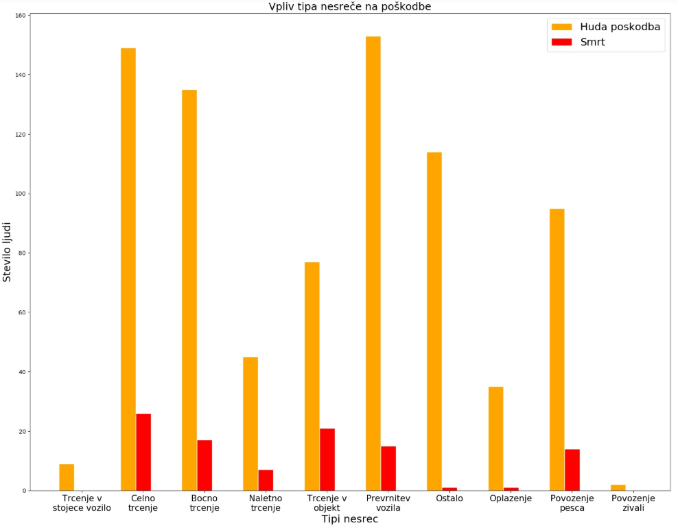
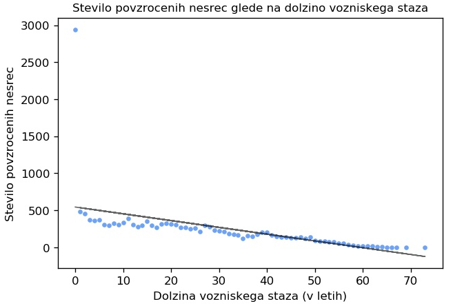
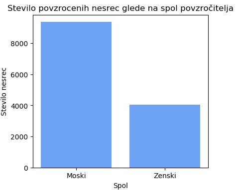

Bian Klančnik, Jan Weissenbach, Gal Lindič, Tadej ločniškar in Ožbej Golob

## 
Analiza prometnih nesreč leta 2019 (v Sloveniji)

# 
Projektna naloga pri predmetu Podatkovno rudarjenje

Mentor: doc. dr. Tomaž Curk

## Uvod

Pri projektni nalogi smo si izbrali podatkovno zbirko, ki beleži različne podatke o prometnih nesrečah v letu 2019. Nad podatki smo izvedli analizo, pri tem smo analizirali podatke, ki so se nam zdeli zanimivi. Rezultate smo predstavili tudi s pomočjo različnih vizualizacij.

## Opis podatkovne zbirke

Za temo naše projektne naloge smo si izbrali podatkovno zbirko [Prometne nesreče v letu 2019](https://www.policija.si/o-slovenski-policiji/statistika/prometna-varnost).

Atributi se nahajajo v `podatki/pn2019.csv`.  
Pomembni atributi, ki smo jih analizirali: UraPN, VzrokNesrece, TipNesrece, VremenskeOkoliscine, StanjeVozisca, Povzrocitelj, Starost, Spol, Drzavljanstvo, UporabaVarnostnegaPasu, VozniskiStazVLetih, VozniskiStazVMesecih, VrednostAlkotesta.

## Cilji

* Vpliv alkohola, ure, spola, vozniškega staža na število povzročenih nesreč
* Vpliv tipa nesreče na poškodbe
* Vpliv uporabe varnostnega pasu na tip poškodbe

## Predstavitev rezultatov

### Vrste poškodb glede na uporabo varnostnega pasu

Ko smo obdelali podatke, smo ugotovili naslednje:

* Število udeležencev prometnih nesreč, ki so bili pripeti z varnostnim pasom: **26897**
* Število udeležencev prometnih nesreč, ki so niso bili pripeti z varnostnim pasom: **3006**
* Odstotek ljudi, ki so bili pripeti: **89.9**

Vidimo, da je bilo **90%** ljudi, udeleženih v prometnih nesrečah, pripetih z varnostnim pasom.

Po vizualizaciji ugotovimo naslednje:

* Odstotek nesreč s smrtnim izidom, kjer je bil udeleženec pripet z varnostnim pasom: **0.21%**
* Odstotek nesreč s smrtnim izidom, kjer udeleženec ni bil pripet z varnostnim pasom: **1.23%**
* Odstotek nesreč z hudimi telesnimi poškodbami, kjer udeleženec ni bil pripet z varnostnim pasom: **8.51%**
* Število mrtvih ljudi, ki niso bili pripeti z varnostnim pasom: **37**

Prej smo ugotovili, da je bilo **90%** udeležencev prometnih nesreč pripetih z varnostnim pasom. Od ostalih **10%** ljudi, ki niso bili pripeti z varnostnim pasom jih je **1.23%** umrlo v prometni nesreči, kar je **1%** več, kot pa pri udeležencih, kateri so bili pripeti. Hude telesne poškodbe jih je imelo okrog **9%**.

### Število povzročenih nesreč glede na uro

Pred vizualizacijo smo pričakovali, da bo največ nesreč zjutraj od 6 do 8 ure in od 14 do 16, ker se takrat ljudje vozijo v in iz službe.

Po vizualizaciji smo ugotovili, da se največ nesreč res zgodi **med 14 in 16 uro**, vendar pa je nesreč v jutranjih urah manj kot smo pričakovali.

#### Število povzročenih nesreč glede na uro, kjer je voznik pijan

Pri obdelavi podatkov smo ugotovili, da so v letu 2019 pijani vozniki povzročili **6.3%** vseh nesreč.  
Od vseh nesreč je imelo smrtno žrtev **0.5%** nesreč. Proti pričakovanjem pa se je od vseh nesreč, ki jih je povzročil pijan voznik, s smrtno žrtvijo končalo samo **0.2%**.

Pri pijanih voznikih pa smo pričakovali, da se bo število nesreč proti večeru večalo. Največje število nesreč smo pričakovali nekje med 1. in 3. uro zjutraj.

Po vizualizaciji smo ugotovili, da je največ nesreč zaradi pijanih voznikov **ob 19. uri**. Presenetljivo po tem začne število nesreč padati.

### Število poškodb glede na tip nesreče

Iz vizualizacije smo izpustili nesreče, kjer so udeleženci brez poškodb oziroma z lažjimi poškodbami. Kot vidimo, je vrsta poškodbe odvisna od tipa nesreče. Iz grafa vidimo, da je pri čelnem trčenju največ smrtnih primerov, medtem ko pri povoženju živali ni bilo nobene smrtne žrtve (živali not included).

### Graf števila smrti glede na tip udeleženca

V poročilih pogosto zaslediš, da pijan voznik povozi koga, sam pa jo odnese brez poškodb. Zato nas je zanimalo, kakšno je število smrti povzročiteljev nesreč v primerjavi z udeleženci.

Kot vidimo v vizualizaciji, je v resnici večje število (približno **60%**) mrtvih povzročiteljev.

### Število povzročenih nesreč glede na vozniški staž

Splošno mnenje ljudi je, da mladi vozniki povzročijo več nesreč kot izkušeni, zato smo se odločili, da bomo to hipotezo preverili.

Kot lahko vidimo, se število povzročenih nesreč z dolžino vozniškega staža drastično zmanjša. Nad temi podatki smo izračunali pearsonov koeficient, ki je enak **-0.95**. To pomeni, da sta si dolžina vozniškega staža in število povzročenih nesreč **obratno sorazmerna**.

Izračunali smo tudi, da ljudje, mlajši od 21 let, povzročijo **8%** vseh prometnih nesreč. Od vseh nesreč s smrtnim izzidom, so jih **6.45%** povzročili ljudje, mlajši od 21 let.

### Graf števila povzročenih nesreč glede na spol

Splošno mnenje (moških) je, da so ženske slabše voznice, zato smo se odločili preveriti število povzročenih nesreč glede na spol.

Po vizualizaciji opazimo, da so moški povzročili približno **dvakrat več** nesreč kot ženske. Vendar pa pri tem ne vemo, koliko procentov od vseh voznikov je moških, koliko pa žensk.

### Graf števila nesreč po uri v dnevu

Spodnja vizualizacija prikazuje, kje vse v Sloveniji so se dogajale nesreče v določenem mescu. Pri tem vsaka pika na grafu predstavlja eno prometno nesrečo.

## Zaključek

