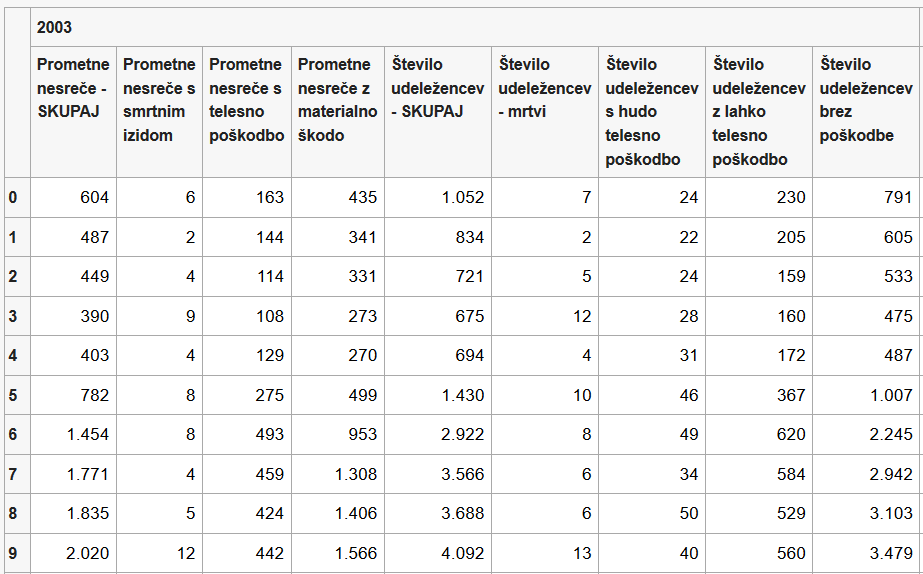

# Opis problema

Za problem smo si izbrali odprto podatkovno zbirko »Cestnoprometne nesreče in udeleženci v nesrečah po urah dneva« (Slovenija, letni podatki od 2003 do 2014).

Na tej podatkovni množici bomo naredili obdelavo podatkov. Pogledali bomo, ali je število prometnih nesreč odvisno od ure, koliko je smrtnih žrtev, poškodovanih ipd. Pogledali bomo tudi, kako je število nesreč odvisno od leta. Ugotavljali bomo tudi, če je število nesreč korelirano s številom smrtnih žrtev itd. Naredili bomo tudi ustrezne vizualizacije in animacije.

Prvi stolpec je ura (od 0 do 23), nato pa ima vsako leto od 2003 do 2014 devet stolpcev.

Stolpci so:
prometne nesreče- skupaj, prometne nesreče s smrtnim izidom, prometne nesreče s telesno poškodbo, prometne nesreče z materialno škodo, število udeležencev- skupaj, število udeležencev- mrtvi, število udeležencev s hudo telesno poškodbo, število udeležencev z lahko telesno poškodbo, število udeležencev brez poškodbe.

Link do podatkov: https://podatki.gov.si/dataset/surs2222005s
